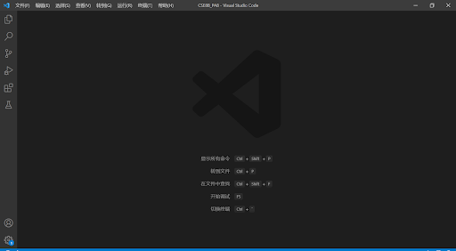
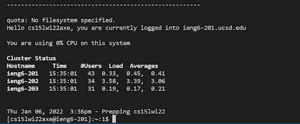
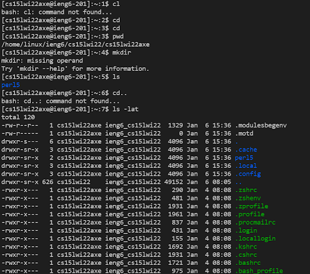
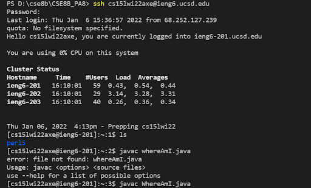
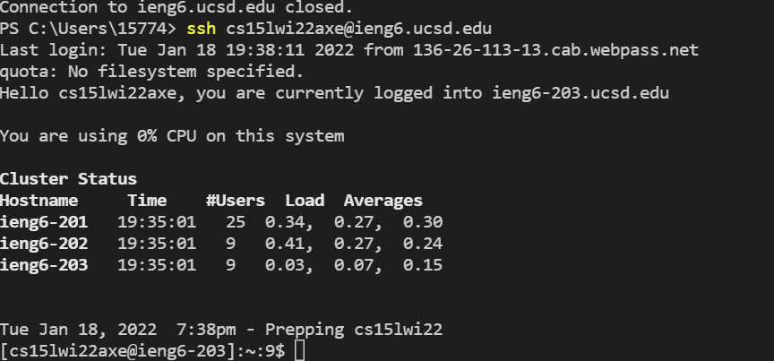
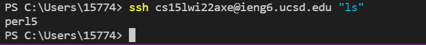
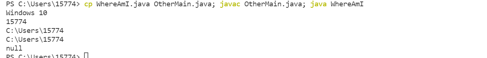

# Lab-Report-1-Week-2

## Part 1: Introduction
* The goal for this lab is to set up the system and environment for the CSE Lab wiht commands that work with the filesystem

## Part 2: installing Visual Studio Code
* Download the VS Code on the webiste [Visual studio Code](https://code.visualstudio.com/)
* Slect the correct version for your computer OSX (for Macs) and Windows (for PCs)
* After the installation, you should see a work station look like this

## Part 3: Remotely Connecting
* After you get your account you should enter this command in your terminal "ssh cs15lwi22zz@ieng6.ucsd.edu" with your account name
* Type in the password to login
* After your login to your ssh account, you should see the following
 

## Part 4: Run Some Commands
* Try running the commands cd, ls, pwd, mkdir, and cp a few times in different ways
* See what comes out after enter your command
* To logout, you can enter the command "exit"
* There are some useful commands you can try:
`cd ~`
`cd`
`ls -lat`
`ls -a`
* `/home/linux/ieng6/cs15lwi22/cs15lwi22abc` where the `abc` is one of the other group members’ username
* `cp /home/linux/ieng6/cs15lwi22/public/hello.txt ~/`
* `cat /home/linux/ieng6/cs15lwi22/public/hello.txt`

## Part 5: Moving Files With Scp
* Create a file on your computer called WhereAmI.java and put the following contents into it:

` class WhereAmI {
  public static void main(String[] args) {
    System.out.println(System.getProperty("os.name"));
    System.out.println(System.getProperty("user.name"));
    System.out.println(System.getProperty("user.home"));
    System.out.println(System.getProperty("user.dir"));
  }
}`
* Compiled and ran the file on VS Code

* Then ran `scp WhereAmI.java cs15lwi22ags@ieng6.ucsd.edu:~/` to copy this file to the remote server

## Part 6: SSH Key
* This created two new files on your system; the private key (in a file id_rsa) and the public key (in a file id_rsa.pub), stored in the .ssh directory on your computer.
* Follow up the following commands to set your keys

`$ ssh cs15lwi22zz@ieng6.ucsd.edu`

`<Enter Password>`

`# now on server`

`$ mkdir .ssh`

`$ <logout>`

`# back on client`

`$ scp /Users/joe/.ssh/id_rsa.pub cs15lwi22@ieng6.ucsd.edu:~/.ssh/authorized_keys`

`# You use your username and the path you saw in the command above `

* After your password is all set, you can login without entering the password

## Part 7 – Making Remote Running Even More Pleasant
* You can write a command in quotes at the end of an ssh command to directly run it on the remote server, then exit.
* Like the following:

* Keystrokes:
* 1. Use up-arrow key for command `scp WhereAmI.java cs15lwi22axe@ieng6.ucsd.edu:~/` return, tooks 4 keystrokes.
  2. Use up-arrow key for command `ssh cs15lwi22axe@ieng6.ucsd.edu` tooks 2 keystrokes.
  3. Copy-paste the following command: `cp WhereAmI.java OtherMain.java; javac OtherMain.java; java WhereAmI` to the end of the previous command,  which takes me 3 keystrokes.
* Total 9 Keystrokes.
* These following commands is a multiple commands on the same line which will shows your user folder:

