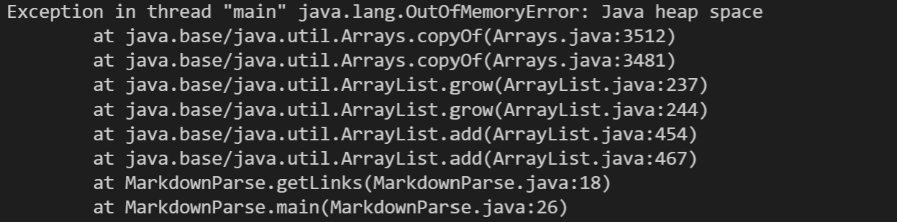
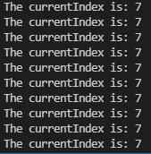
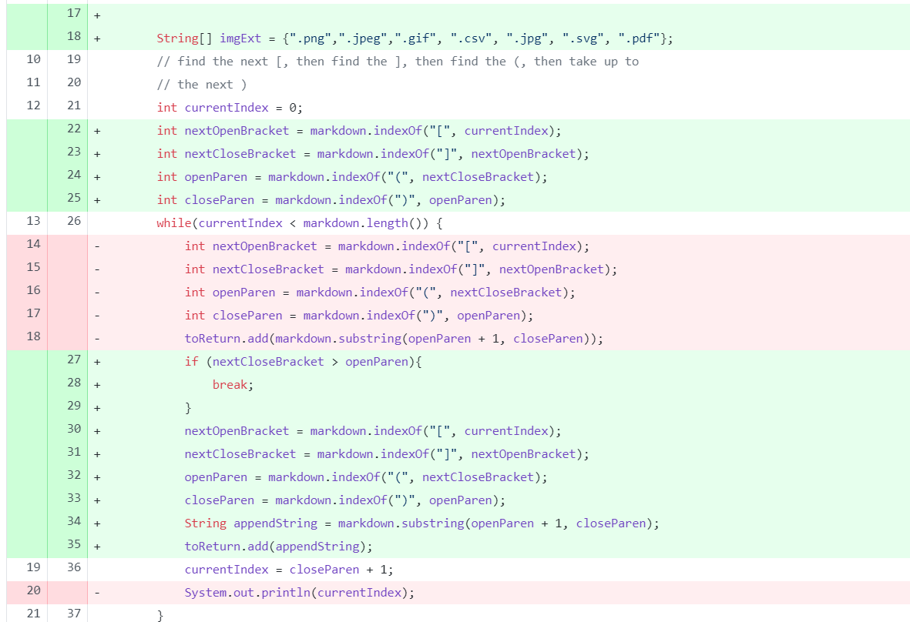
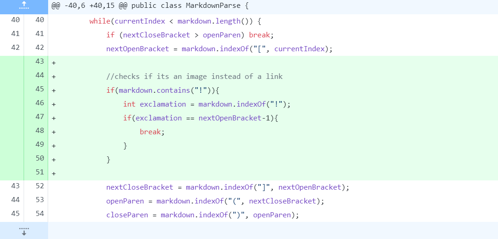
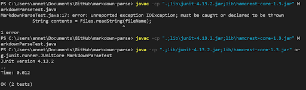
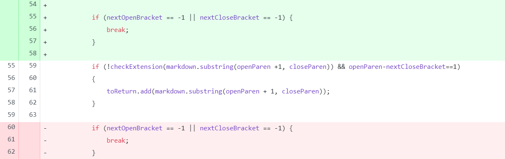

# Lab Report 2 week 4
## 3 fixing test cases
## Case 1
* In this case, we had a error output that keeps print 7s which is a infinite loop.
The error inducing input is like:

This is the *failure-inducing input*: [test-file6.md](test-file6.md)
* When we print the current index out by `System.out.println` it keeps output 7

* The reason why the infinite loop exist is because our brakect was not been set. So the program keeps trying to find the index of the open and close parenthesis after the index of the next closed bracket.
Then in every loop `nextOpenBracket` is not updated, so none of the other variables will be updated.
* Here is what we have done to fix it:

## Case 2 
The failing output is like: 

This is the *failure-inducing input*: [test-file2.md](test-file2.md)
* To fix this error we have to check the link is image or website link, it can has a big difference with `!` or not. So we set a condition checks whether it contains "!", we only wnats the webiste link to be printed.

## Case 3
* This time we still can not passes all the junit test cases. The error could be we keeps copy the first link over and over again.

The failing output is like: [test-file2.md](test-file2.md)
[Link to the error inducing code](https://github.com/jahyng/markdown-parse/blob/962d5eaff21ec883967f6612652a40a08d0fa21e/MarkdownParse.java)
* Since we had put the if condition before it checks extension by `checkExtensions()`. Which means the loop will not stop till it loops one more time. So move the extension statement will helps to fix the problem.

