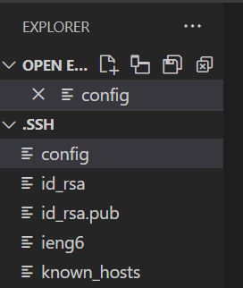
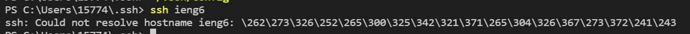
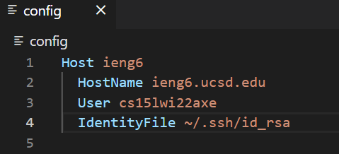
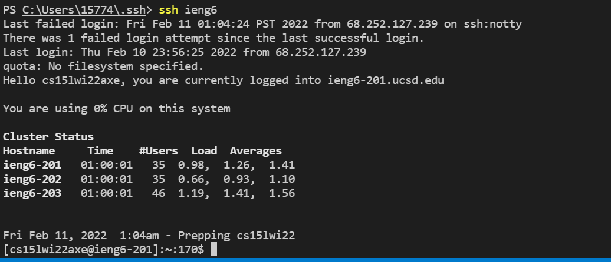
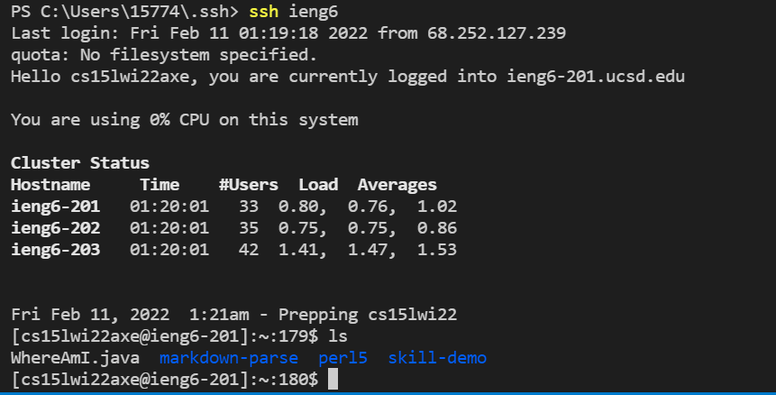

# Lab Report 3 - week 6

## Streamlining ssh Configuration

* Create or open the config file from `~/.ssh/config`, when you finish you should see your folder open like

* first you can try just adding the  
   `Host ieng6`
   
   `HostName ieng6.ucsd.edu`
   
   `User cs15lwi22zzz (use your username) `
* And then try this command:
  `ssh ieng6`
* If you having a problem to login, (might looks like the following)

* Then try adding a line to explicitly refer to your `id_rsa` file: 
  
  

* Now it would be less job to login with your ssh!

* Also try scp a file, it would be much faster for you to copy a file. As you see following.

