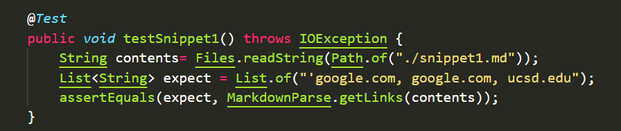
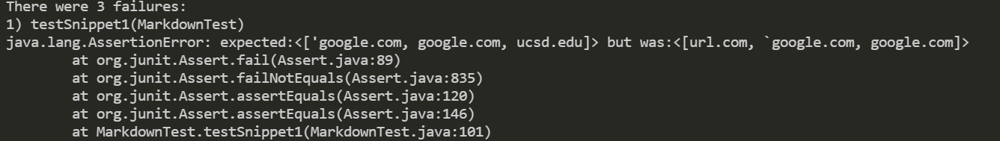
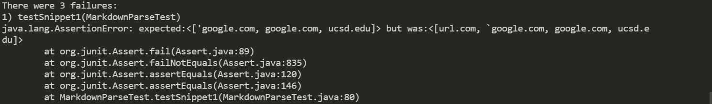
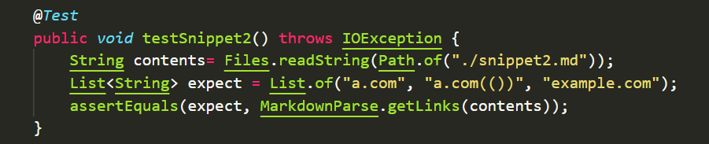
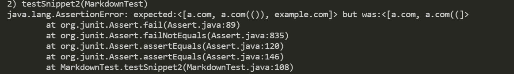
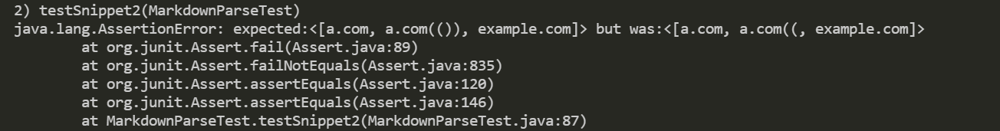
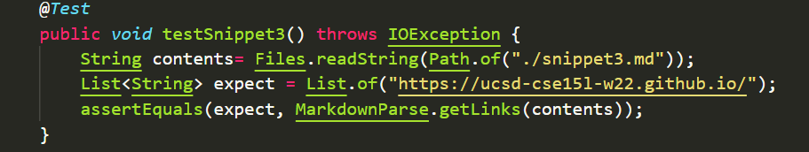
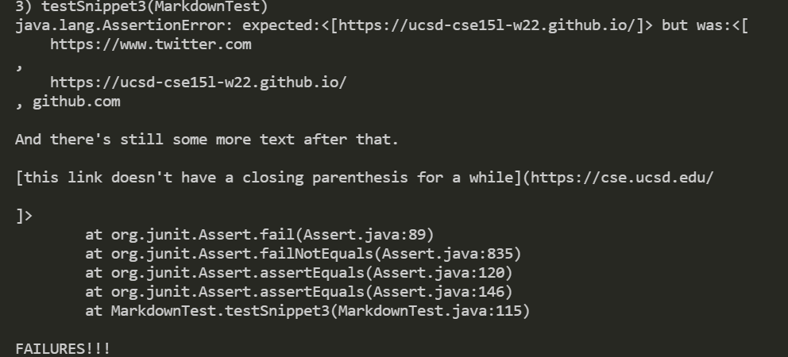
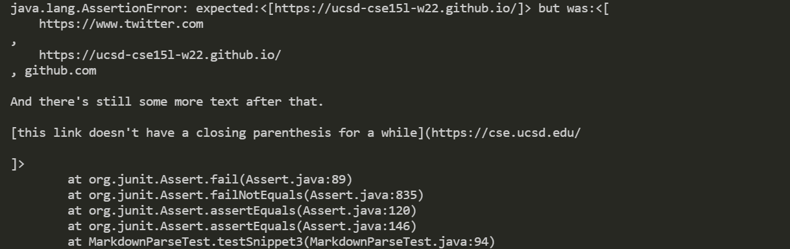

# Lab Report 4 - week 8
## Three markdown snippets implementations

[Link to my inplementation](https://github.com/KidaChh029/markdown-parse)

[Link to the inplementation I reviewed](https://github.com/Darrengn/markdown-parse)

## Snippet 1
Test:

Expected: `['google.com, google.com, ucsd.edu]`

My implemented result:

My reviewed implemented result:

* Do you think there is a small (<10 lines) code change that will make your program work for snippet 1 and all related cases that use inline code with backticks? If yes, describe the code change. If not, describe why it would be a more involved change.
* After playing around with the first snippet for a while. I think the snippet1 can be fixed for the cases I could think of. We can add a conditional statement that checks if there are any backticks in the syntax of the link. If a backtick actually exist before or in the parentheses, then include a break command that would prevent that link from being added to the returned array.

## Snippet 2
Test:

Expected: `[a.com, a.com(()), example.com]`

My implemented result:

My reviewed implemented result:

* Do you think there is a small (<10 lines) code change that will make your program work for snippet 2 and all related cases that nest parentheses, brackets, and escaped brackets? If yes, describe the code change. If not, describe why it would be a more involved change.
* After playing around with the second snippet for a while. I do not think the small code changes of snippet2 can fix the cases I could think of. It is not the case we can simply fix with conditional statments. In order to fix this, we have to giveup having the program search directly for the next closing parentheses. We should do the searching for the last parentheses.

## Snippet 3
Test:

Expected: `[https://ucsd-cse15l-w22.github.io/]`

My implemented result:

My reviewed implemented result:

* Do you think there is a small (<10 lines) code change that will make your program work for snippet 3 and all related cases that have newlines in brackets and parentheses? If yes, describe the code change. If not, describe why it would be a more involved change.
* I do not think the small code changes of snippet3 can fix the cases I could think of. It is not the case we can simply fix with conditional statments. In order to fix this, it require more code changes than 10 lines, since the program were able to filter out \n from the links. So we have to check the returned array to see if it has a length greater than one, which indicates whether or not the link has more than one line break. If the link has more than one break, the program should stop running. 
