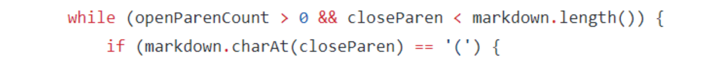

# Lab Report 5 - week 10
## comparison and difference
In lab 9, I experimented with the many tests provided from commonmark-spec.
I choose two tests from the 652 commonmark-spec tests where your implementation had different answers than the implementation provided for lab 9.
Here is a part of listed differences, I found than by checking the difference between mine and provided implementation.

## First 1

Corresponds to test-file580.md  To see what was in this file, I used the command cat cse15l-markdown-parse/test-files/580.md, which displayed the following:

    
    
Since my implementation oup put is what above, and the provided implementation is the below.
My implementation gaves the correct output, and the output the provided implementation gave a image extension that was not allowed.

The problem is from the provded implementation does not check the link has a image extension or not.
So we have to add an statement to check whether there is "!" exists right before the first open brackets.
The program should not run or break if the "!" exists. We should put this statement right before the while loop runs.

## Second 2

Corresponds to test-file194.md  To see what was in this file, which displayed the following:

Since my implementation oup put is what above, and the provided implementation is the below.
My implementation gaves the correct output because the link syntax is incorrect in the test-file,and the output the provided implementation is incorrect.

To fix the problem, we should make the program to consider the case where there is text that comes between the occurence of a close bracket and an open paranthesis.
By doing this, adding a check for if an open parenthesis comes right after the closed brackets. 
so that it was only counted as valid if the open paranthesis immediately followed the closed bracket, like such ](.

Changes should be achieved between these two lines of code.

